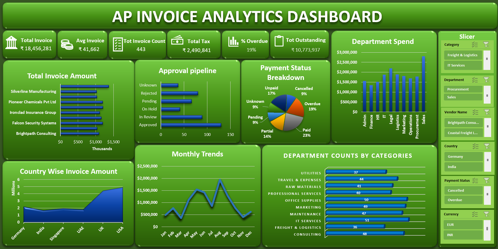

# AP Invoice Analytics Dashboard

An interactive Excel dashboard built from a raw, messy Accounts Payable (AP) invoice dataset — covering end-to-end data cleaning, PivotTable analysis, and dashboard design.

## Overview

This project started with a 456-row raw invoice export containing realistic data-quality issues commonly seen in finance/accounting systems: inconsistent date formats, currency values stored as text, duplicate invoice IDs, and messy categorical fields. The goal was to clean the dataset, validate its logical integrity, and build a dashboard that answers key AP questions at a glance.

## Problem

The raw dataset had:
- 7 completely blank rows and 15 duplicate Invoice IDs
- Dates in 5–6 different formats (`DD.MM.YYYY`, `March 05, 2024`, `DD-Mon-YYYY`, etc.)
- Invoice amounts stored as text with mixed currency symbols (`$30,631.24`, `Rs. 65,579.47`)
- Inconsistent casing, whitespace, and abbreviations across Vendor, Department, and Country fields
- Logical inconsistencies — e.g. Due Dates earlier than Invoice Dates, and Payment Dates present on invoices marked as unpaid

## What I Did

**Data Cleaning**
- Standardized all dates to a single unambiguous format (`dd-mmm-yyyy`) to eliminate day/month confusion
- Converted text-based currency values into clean numeric fields and standardized currency codes
- Removed duplicate Invoice IDs and resolved blank rows
- Standardized Vendor, Department, Country, and status fields (casing, trailing characters, abbreviations)
- Classified missing values as either fillable (derived from other columns, e.g. Tax %) or genuinely unknown, and labeled them consistently instead of leaving blank/empty-string inconsistencies

**Data Validation**
- Cross-checked that Due Date never precedes Invoice Date
- Verified Payment Date is populated only when Payment Status is "Paid"
- Caught and corrected a stale-filter bug where an active slicer selection was silently excluding rows from KPI totals — a reminder to always clear filters before finalizing summary metrics

**Dashboard Build**
- 14 PivotTables and 7 charts (bar, pie, line, and area/map visualizations) covering vendor spend, department costs, payment status, monthly trends, approval pipeline, and country-wise spend
- 6 KPI summary cards: Total Invoice Amount, Average Invoice Value, Total Invoice Count, Total Tax, % Overdue, and Total Outstanding Amount
- 6 interactive slicers (Category, Department, Vendor, Country, Payment Status, Currency) for real-time filtering across all visuals

## Tools Used
Microsoft Excel — PivotTables, PivotCharts, SUMIFS/SUMIF, Slicers, Data Validation, Conditional Formatting

## Files
- `AP_Invoice_Raw_Messy.xlsx` — original raw dataset before cleaning
- `AP_Invoice_Cleaned_Dataset.xlsx` — final cleaned dataset + interactive dashboard
- `dashboard-screenshot.png` — dashboard preview image

## Key Takeaway
Beyond the cleaning techniques, this project reinforced the importance of validating a dashboard's own outputs — not just the source data. A filter left active during formula-building silently skewed KPI totals until it was caught through a manual cross-check, which is now a standard step I apply to every dashboard I build.
